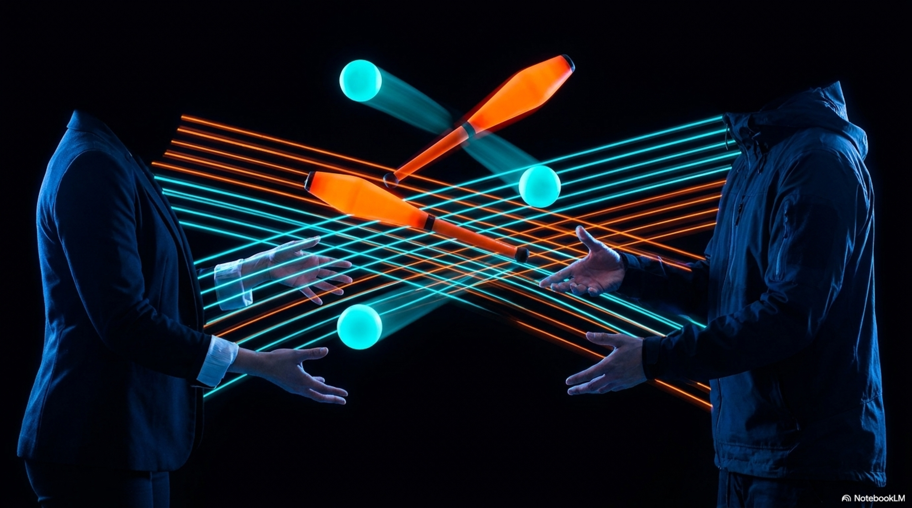

import StatGrid from '../../components/StatGrid.astro';
import Callout from '../../components/Callout.astro';
import Diagram from '../../components/Diagram.astro';
import PullQuote from '../../components/PullQuote.astro';
import Takeaways from '../../components/Takeaways.astro';
import AnalogyTable from '../../components/AnalogyTable.astro';

<StatGrid items={[
  { value: "4", label: "Siteswap value", sub: "a constant sequence - every throw is a 4, returning to the same hand that threw it. No crossing required.", color: "tech" },
  { value: "2", label: "Independent circuits", sub: "the four-ball fountain splits into two separate 2-ball loops - one per hand. Each hand juggles independently.", color: "brain" },
  { value: "~1.0m", label: "Peak height at normal tempo", sub: "lower than the cascade because even throws return to the same hand - shorter cross-body distance", color: "change" },
  { value: "80%", label: "Jugglers who find 4 harder than 5", sub: "counterintuitively, many jugglers find the mathematical simplicity of 4 harder to learn than 5 - for reasons rooted in coordination neuroscience", color: "yellow" }
]} />

The four-ball fountain is structurally a different animal from the three-ball cascade. The cascade has three balls crossing continuously from hand to hand. The fountain has four balls that never cross: each hand throws only to itself, maintaining two independent circular loops simultaneously. The siteswap is `4` - a constant sequence. The throw value 4 means the ball returns to the same hand after 4 beats, because 4 is even.

This single mathematical difference - odd versus even - changes the cognitive and neural demands of the pattern substantially. Buhler, Eisenbud, Graham and Wright (1994) gave the formal account of why: in their treatment of siteswap as a combinatorial system, parity controls which hand catches each throw, and that single bit reorganises the entire coordination problem.

## Odd versus even: the mathematical divide

In siteswap notation, a throw with value `v` lands in hand `(throwing_hand + v) mod 2`. Since we have two hands (0 = left, 1 = right):

- Odd values (1, 3, 5, 7...): `(hand + odd) mod 2` = opposite hand. The throw crosses.
- Even values (2, 4, 6, 8...): `(hand + even) mod 2` = same hand. The throw returns.

For the cascade (`3`): every throw crosses. The pattern is a single loop involving both hands simultaneously.

For the fountain (`4`): every throw returns. The pattern splits into two independent loops, one per hand. The hands are mathematically decoupled.

This mathematical decoupling is the source of what many jugglers describe as the "isolated" feeling of the fountain. Each hand is doing its own job. The hands do not depend on each other's timing in the way they do in the cascade.

<Diagram caption="Cascade vs fountain: the coupling structure. In the cascade (left), both hands participate in a single shared loop. In the fountain (right), each hand runs its own independent loop. The arrows show throw destinations.">
<svg viewBox="0 0 560 200" xmlns="http://www.w3.org/2000/svg" fill="none">
  <defs>
    <marker id="fb-arr" markerWidth="7" markerHeight="5" refX="6" refY="2.5" orient="auto">
      <polygon points="0 0, 7 2.5, 0 5" fill="#9696b0"/>
    </marker>
    <marker id="fb-arr-g" markerWidth="7" markerHeight="5" refX="6" refY="2.5" orient="auto">
      <polygon points="0 0, 7 2.5, 0 5" fill="#33cc66"/>
    </marker>
    <marker id="fb-arr-b" markerWidth="7" markerHeight="5" refX="6" refY="2.5" orient="auto">
      <polygon points="0 0, 7 2.5, 0 5" fill="#3b6cff"/>
    </marker>
  </defs>
  <rect width="560" height="200" rx="8" fill="#0d0d1a"/>

  <text x="140" y="20" fill="#9696b0" font-size="11" font-family="sans-serif" text-anchor="middle">Cascade (siteswap 3): one shared loop</text>
  <text x="420" y="20" fill="#9696b0" font-size="11" font-family="sans-serif" text-anchor="middle">Fountain (siteswap 4): two independent loops</text>

  <line x1="280" y1="15" x2="280" y2="195" stroke="#2a2a3d" stroke-width="1"/>

  <circle cx="80" cy="110" r="18" fill="#1a1a2e" stroke="#33cc66" stroke-width="2"/>
  <text x="80" y="115" fill="#33cc66" font-size="10" font-family="monospace" text-anchor="middle">Left</text>

  <circle cx="200" cy="110" r="18" fill="#1a1a2e" stroke="#33cc66" stroke-width="2"/>
  <text x="200" y="115" fill="#33cc66" font-size="10" font-family="monospace" text-anchor="middle">Right</text>

  <path d="M96 97 Q140 50 184 97" stroke="#33cc66" stroke-width="2" marker-end="url(#fb-arr-g)"/>
  <path d="M184 123 Q140 170 96 123" stroke="#33cc66" stroke-width="2" marker-end="url(#fb-arr-g)"/>
  <text x="140" y="48" fill="#33cc66" font-size="10" font-family="monospace" text-anchor="middle">3 (cross)</text>
  <text x="140" y="185" fill="#33cc66" font-size="10" font-family="monospace" text-anchor="middle">3 (cross)</text>

  <circle cx="340" cy="80" r="18" fill="#1a1a2e" stroke="#3b6cff" stroke-width="2"/>
  <text x="340" y="85" fill="#3b6cff" font-size="10" font-family="monospace" text-anchor="middle">Left</text>

  <circle cx="500" cy="80" r="18" fill="#1a1a2e" stroke="#ff8c00" stroke-width="2"/>
  <text x="500" y="85" fill="#ff8c00" font-size="10" font-family="monospace" text-anchor="middle">Right</text>

  <path d="M340 62 Q340 30 340 62" stroke="#3b6cff" stroke-width="0"/>
  <path d="M327 70 Q310 45 327 68" stroke="#3b6cff" stroke-width="2" marker-end="url(#fb-arr-b)"/>
  <path d="M353 70 Q370 45 353 68" stroke="#3b6cff" stroke-width="2" marker-end="url(#fb-arr-b)"/>
  <text x="340" y="38" fill="#3b6cff" font-size="9" font-family="monospace" text-anchor="middle">4 (self loop)</text>

  <path d="M487 70 Q470 45 487 68" stroke="#ff8c00" stroke-width="2" marker-end="url(#fb-arr)"/>
  <path d="M513 70 Q530 45 513 68" stroke="#ff8c00" stroke-width="2" marker-end="url(#fb-arr)"/>
  <text x="500" y="38" fill="#ff8c00" font-size="9" font-family="monospace" text-anchor="middle">4 (self loop)</text>

  <text x="420" y="120" fill="#9696b0" font-size="9" font-family="monospace" text-anchor="middle">Each hand: independent 2-ball shower</text>
  <text x="420" y="135" fill="#9696b0" font-size="9" font-family="monospace" text-anchor="middle">No coupling between left and right</text>
</svg>
</Diagram>

## Why four is often harder to learn than five

Counterintuitively, most jugglers find the 4-ball fountain harder to learn than the 5-ball cascade, despite 5 requiring more objects and higher throws. The reason is coordination asymmetry.

The 3-ball cascade uses alternating throws: right, left, right, left. Each throw is triggered by the previous catch on the opposite side. The hands are constantly giving each other timing cues. This tight coupling makes the pattern self-cueing - one hand's action sets up the other's.

The 4-ball fountain requires both hands to operate simultaneously in parallel at the same tempo. There is no cross-body cue. The left hand must maintain its own consistent throw height and timing while the right hand does the same, independently.

This places much higher demands on internal rhythm generation - the ability to maintain a steady tempo without external cues. Research by Wing and Kristofferson (1973) on the neural mechanisms of timing shows that internally generated rhythms have higher variability than externally cued rhythms. The cascade gives each hand an external cue (the opposite hand's throw); the fountain provides none.

The 5-ball cascade, despite having more balls, uses the same alternating cross structure as the 3-ball cascade. The hands are still coupled, still cueing each other. The difficulty is higher, but it uses a coordination structure the nervous system already knows.

<Callout type="info" title="The independent timing requirement">
Wing, A.M., and Kristofferson, A.B. (1973). "Response delays and the timing of discrete motor responses." *Perception and Psychophysics*, 14(1), 5-12. This paper established the timekeeper model of rhythmic timing, which predicts higher variance for self-generated rhythms - directly explaining why the decoupled fountain is harder to stabilize than the coupled cascade.
</Callout>

## The crossing fountain: (4x,4)(4,4x)

A close cousin of the standard fountain produces trails that cross instead of running parallel. This is the **crossing fountain**, siteswap `(4x,4)(4,4x)` in synchronous notation.

In the crossing fountain, throws alternate between crossing to the opposite hand and returning to the same hand. The pattern uses synchronous throws (both hands throw simultaneously) with the `x` modifier indicating a crossing throw.

The siteswap validity check: each pair `(4x, 4)` contributes a cross-hand 4 and a same-hand 4. Per hand: value 4, which returns to the same hand. The combined state satisfies the validity condition.

Visually: the crossing fountain looks more like a cascade, with balls weaving across each other. Physically it is still a 4-ball pattern with the same timing constraints as the standard fountain, but with a richer visual texture - the trails form X shapes rather than parallel columns.

The same structure appears at a larger scale in two-person passing: two independent circuits (one per juggler) that cross at a fixed exchange point. The mathematics of individual patterns and passing patterns share the same underlying graph structure - the difference is which nodes in the graph belong to which performer.

## The neurological boundary at 4

Research on the development of juggling skill has identified a consistent difficulty spike at the 3-to-4 ball transition that is not present at 4-to-5. Several studies (Beek and colleagues, 1990s) attribute this to the transition from alternating to parallel motor programs:

- 1-2-3 balls: alternating coordination, externally cued
- 4 balls: parallel coordination, internally timed
- 5+ balls: alternating coordination again (cascade structure), externally cued

The 4-ball boundary is the only point where the coordination type changes. This predicts - correctly - that jugglers who have learned 5 balls often find 4-ball fountain easier than jugglers who have learned only 3, because 5-ball experience develops the internal timing required for the fountain.

<PullQuote>
"Four is not two more than two. It is a different kind of coordination. The cascade has two hands working together on a shared problem. The fountain has two hands working separately on parallel problems. That difference in coupling structure is the entire difficulty of the transition."
</PullQuote>

## Further reading

- **Wing, A.M., and Kristofferson, A.B.** (1973). "Response delays and the timing of discrete motor responses." *Perception and Psychophysics*, 14(1), 5-12. The timekeeper model.
- **Beek, P.J.** (1989). *Juggling Dynamics*. PhD thesis, Free University Amsterdam. The foundational biomechanical study of juggling coordination.
- **Buhler, J. et al.** (1994). "Juggling Drops and Descents." *American Mathematical Monthly*, 101(6). See: The Mathematics of Siteswap for full treatment.
- **Summers, J.J.** (1992). "Movement Behavior: A Field in Crisis?" Chapter on bimanual coordination and parallel vs alternating motor programs.

<Takeaways items={[
  "Odd siteswap values cross hands; even values return to the same hand. The 4-ball fountain has no crossing throws - each hand runs an independent 2-ball loop with no coupling to the other hand.",
  "The cascade (odd) is self-cueing: each hand's action triggers the other's. The fountain (even) requires both hands to maintain parallel independent rhythms with no external cue - a harder coordination type.",
  "Many jugglers find 4 balls harder than 5 because 5 uses cascade (alternating, coupled) coordination while 4 uses fountain (parallel, uncoupled) coordination. The difficulty is in the coordination type, not the ball count.",
  "The crossing fountain (4x,4)(4,4x) uses synchronous throws with alternating crosses and returns, producing the X-trail visual. Same timing constraints as standard fountain, different visual structure.",
  "The 4-ball transition is the only place in the standard learning progression where coordination type changes. All other transitions (1-2-3, 5, 7...) stay within the alternating-hands paradigm."
]} />

---

*On this site: [The Mathematics of Siteswap](/post/the-mathematics-of-siteswap) is the formal foundation - the theorem that explains why odd values cross and even values return. [Three Props, Three Physics](/post/three-props-three-physics) covers how the choice of prop changes the physical and neural constraints independently of ball count. [Adding the Fourth Ball: On Scaling and Complexity](/post/adding-the-fourth-ball) explores the same 3-to-4 transition from the perspective of system design and cognitive complexity.*
