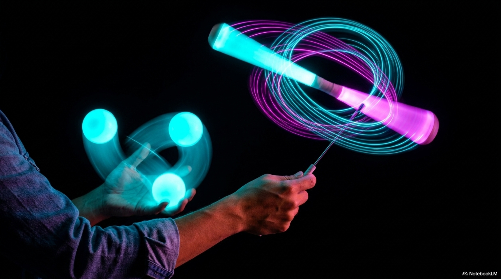

import StatGrid from '../../components/StatGrid.astro';
import Callout from '../../components/Callout.astro';
import Diagram from '../../components/Diagram.astro';
import PullQuote from '../../components/PullQuote.astro';
import Takeaways from '../../components/Takeaways.astro';

<StatGrid items={[
  { value: "3", label: "Simultaneous motor programs active", sub: "balls, clubs, and rings each require distinct release parameters - running all three simultaneously is not addition but multiplication of constraints", color: "brain" },
  { value: "~300°", label: "Visual field utilized", sub: "tracking props in all directions simultaneously requires nearly the full horizontal visual field - peripheral motion detection at maximum extent", color: "tech" },
  { value: "2-3s", label: "Time window before overload in novices", sub: "novice jugglers attempting multi-prop work typically reach cognitive overload within seconds - experts can sustain indefinitely", color: "change" },
  { value: "1", label: "Attentional focus point", sub: "despite the visual complexity, expert multi-prop jugglers report a single attentional anchor - the center of the pattern, not individual objects", color: "yellow" }
]} />

The light sphere around the juggler is a long-exposure photograph of every prop's path during a performance. Each arc belongs to a different object: the cyan loops are balls, the spiral cones are clubs, the flat rings trace their own planes. All of them are in the air simultaneously.

This image represents the maximum state of juggling complexity: not more balls in the same pattern, but fundamentally different physical systems operating in parallel. Each has different timing, different constraints, different heights, different trajectories. The juggler at the center is holding all of it at once.

## The computational geometry of the sphere

The sphere in the image is not accidental. When a juggler works with props that travel in all directions - high-thrown balls, club passes above the head, ring spins at shoulder height - the prop paths naturally fill a sphere of space centered on the juggler's body.

The relevant spatial structure is not flat. Consider:
- A high-thrown ball describes a parabola reaching 2+ meters above the hands
- A club thrown as a triple spin describes a wider parabola at the same height but with more horizontal travel
- A ring released at a shallow angle follows a nearly flat parabola close to the body
- A props passed overhead traces an arc above the juggler's head

Together, these fill a spherical volume. The juggler's visual system must monitor the entire sphere simultaneously - a task that saturates the peripheral visual field and approaches the limits of motion detection across multiple spatial planes.

## The devil stick: a different prop philosophy

This image shows the boundary between two different practices. The left hand holds juggling balls - thrown objects that follow parabolic paths. The right hand holds a devil stick - a prop that is never released.

The devil stick (also called the devil stick or flower stick) represents a fundamentally different manipulation paradigm. Unlike balls, clubs, and rings which exist independently in the air during flight, the devil stick is always in contact with hand sticks. The juggler never lets it go. The skill is in the timing and angle of contact, not the release.

This distinction matters for the sphere metaphor: a devil stick does not add arcs to the sphere. It adds a different kind of attention demand - continuous tactile feedback from the stick contacts rather than visual tracking of free-flying props. The cognitive system required is different.

**Research on dual-mode manipulation** (Amazeen, Amazeen, and Beek, 2001) shows that simultaneous operation of throw-and-catch and contact-manipulation tasks produces significantly more interference than two throw-and-catch tasks at equivalent difficulty levels. The neural circuits for these two modes use overlapping attention resources in ways that two juggling tasks do not.

<Diagram caption="Cognitive resources engaged by different prop types. The sphere represents total available attention capacity. Overlap between circles shows resource sharing and interference.">
<svg viewBox="0 0 560 220" xmlns="http://www.w3.org/2000/svg" fill="none">
  <defs>
    <radialGradient id="js-ball" cx="50%" cy="50%" r="50%">
      <stop offset="0%" stop-color="#33cc66" stop-opacity="0.4"/>
      <stop offset="100%" stop-color="#33cc66" stop-opacity="0"/>
    </radialGradient>
    <radialGradient id="js-club" cx="50%" cy="50%" r="50%">
      <stop offset="0%" stop-color="#ff8c00" stop-opacity="0.4"/>
      <stop offset="100%" stop-color="#ff8c00" stop-opacity="0"/>
    </radialGradient>
    <radialGradient id="js-ring" cx="50%" cy="50%" r="50%">
      <stop offset="0%" stop-color="#cc44ff" stop-opacity="0.4"/>
      <stop offset="100%" stop-color="#cc44ff" stop-opacity="0"/>
    </radialGradient>
  </defs>
  <rect width="560" height="220" rx="8" fill="#0d0d1a"/>

  <text x="280" y="20" fill="#9696b0" font-size="10" font-family="sans-serif" text-anchor="middle">Cognitive resource overlap between prop types (novice vs expert)</text>

  <text x="100" y="50" fill="#9696b0" font-size="9" font-family="monospace" text-anchor="middle">Novice</text>

  <circle cx="80" cy="110" r="45" fill="url(#js-ball)" stroke="#33cc66" stroke-width="1.5"/>
  <circle cx="115" cy="140" r="45" fill="url(#js-club)" stroke="#ff8c00" stroke-width="1.5"/>
  <circle cx="115" cy="80" r="45" fill="url(#js-ring)" stroke="#cc44ff" stroke-width="1.5"/>

  <text x="60" y="108" fill="#33cc66" font-size="8" font-family="monospace" text-anchor="middle">Visuospatial</text>
  <text x="60" y="118" fill="#33cc66" font-size="8" font-family="monospace" text-anchor="middle">prediction</text>
  <text x="148" y="158" fill="#ff8c00" font-size="8" font-family="monospace" text-anchor="middle">Wrist</text>
  <text x="148" y="168" fill="#ff8c00" font-size="8" font-family="monospace" text-anchor="middle">calibration</text>
  <text x="148" y="75" fill="#cc44ff" font-size="8" font-family="monospace" text-anchor="middle">Plane</text>
  <text x="148" y="85" fill="#cc44ff" font-size="8" font-family="monospace" text-anchor="middle">sensing</text>

  <text x="400" y="50" fill="#9696b0" font-size="9" font-family="monospace" text-anchor="middle">Expert</text>

  <circle cx="385" cy="110" r="35" fill="url(#js-ball)" stroke="#33cc66" stroke-width="1" opacity="0.7"/>
  <circle cx="415" cy="128" r="32" fill="url(#js-club)" stroke="#ff8c00" stroke-width="1" opacity="0.7"/>
  <circle cx="415" cy="92" r="32" fill="url(#js-ring)" stroke="#cc44ff" stroke-width="1" opacity="0.7"/>

  <text x="360" y="110" fill="#33cc66" font-size="7" font-family="monospace" text-anchor="middle">Visual</text>
  <text x="446" y="142" fill="#ff8c00" font-size="7" font-family="monospace" text-anchor="middle">Motor</text>
  <text x="446" y="80" fill="#cc44ff" font-size="7" font-family="monospace" text-anchor="middle">Proprioception</text>

  <text x="280" y="200" fill="#9696b0" font-size="8" font-family="monospace" text-anchor="middle">Expert: smaller circles (automatization), less overlap (separation of neural circuits)</text>
</svg>
</Diagram>

## The single anchor point

Expert multi-prop jugglers consistently describe a single attentional anchor - a point in space they look toward regardless of what is happening around it. This is the apex region, the highest point in the collective pattern.

Research on expert performance (Huys and Beek, 2002 - see: Juggling and the Science of Attention) shows this anchor point strategy reduces gaze velocity and cognitive load simultaneously. With multiple props in the air, the anchor point becomes even more critical: the juggler cannot possibly track each individual object foveally. The anchor provides a reference frame from which all peripheral motion is interpreted.

This is cognitively analogous to how air traffic controllers manage multiple aircraft on a radar screen: not tracking each plane continuously, but maintaining a global state representation and attending to deviations. The individual props, like individual aircraft, are not watched - their patterns are monitored.

<PullQuote>
"The sphere of light in the image is not what the juggler sees. It is what a camera records over time. The juggler sees almost none of it - one fixation point, and the rest in peripheral motion. The sphere exists in physical space. The juggler lives inside a predictive model."
</PullQuote>

## Complexity collapse: what happens at saturation

There is a point in juggling complexity where adding one more constraint causes the whole system to collapse. This is not a metaphor - it is a measurable threshold.

Research on cognitive load theory (Sweller, 1988, 1994) identifies **germane cognitive load** (resources available for new pattern acquisition) as a finite resource. When total cognitive load approaches capacity, performance degrades non-linearly: small additions produce large drops.

In multi-prop juggling, saturation shows up as **cascade failure** - all props drop simultaneously rather than one at a time. The juggler was holding the pattern together through deliberate attention; when that attention exceeded capacity, the entire shared framework collapsed.

Expert jugglers avoid saturation by progressively automating each prop type before adding another. The cascade (ball pattern) must be fully automatized - running on the equivalent of motor programs rather than active attention - before clubs are introduced. Clubs must be similarly automatized before rings are added to the mix.

Each automatized prop type uses less attentional capacity, shrinking its circle in the resource diagram. The goal is to get all three circles small enough that their total sum stays within capacity even when combined.

## Further reading

- **Sweller, J.** (1988). "Cognitive load during problem solving: Effects on learning." *Cognitive Science*, 12(2), 257-285. Foundation of cognitive load theory.
- **Amazeen, E.L., Amazeen, P.G., and Beek, P.J.** (2001). "Coupling of head and hand movements during juggling." *Ecological Psychology*, 13(2), 101-119.
- **Huys, R., and Beek, P.J.** (2002). "The coupling between point-of-gaze and ball movements in three-ball cascade juggling." *Journal of Sports Sciences*, 20(3).
- **Anderson, J.R.** (1982). "Acquisition of cognitive skill." *Psychological Review*, 89(4), 369-406. The ACT* model of skill automatization.

<Takeaways items={[
  "Multi-prop juggling simultaneously activates distinct motor programs: visuospatial prediction for balls, wrist-torque calibration for clubs, plane-orientation sensing for rings. These recruit overlapping but distinct neural resources.",
  "The devil stick is cognitively different from thrown props - it uses continuous contact feedback rather than free-flight prediction. Mixing throw-and-catch with contact-manipulation produces more interference than two throw-and-catch tasks.",
  "Expert multi-prop jugglers maintain a single spatial anchor point, not distributed attention across all props. The complexity is managed through peripheral detection and predictive modeling, not continuous foveal tracking.",
  "Saturation failure in multi-prop juggling is non-linear: when total cognitive load approaches capacity, all props drop simultaneously. Each prop type must be automatized before being added to a multi-prop combination.",
  "The sphere of light paths is a long-exposure artifact. The juggler sees a single fixation point and peripheral motion - the sphere exists in physical space, not in the juggler's attention."
]} />

---

*On this site: [Juggling and the Science of Attention](/post/juggling-and-the-science-of-attention) covers the eye-tracking and dual-task research behind the single anchor fixation point described here. [What the Hands Remember](/post/what-the-hands-remember) covers motor memory automatization - the mechanism that shrinks each prop's cognitive cost from deliberate to automatic. [Three Props, Three Physics](/post/three-props-three-physics) covers the distinct physical constraints that make each prop in the sphere cognitively different.*
