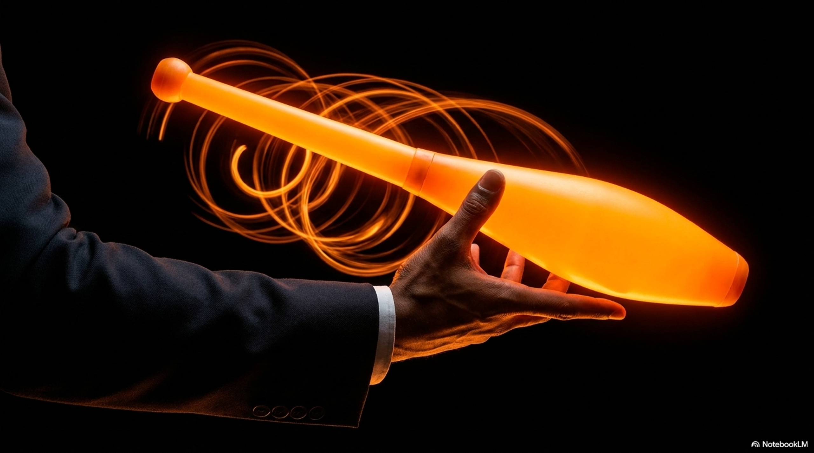
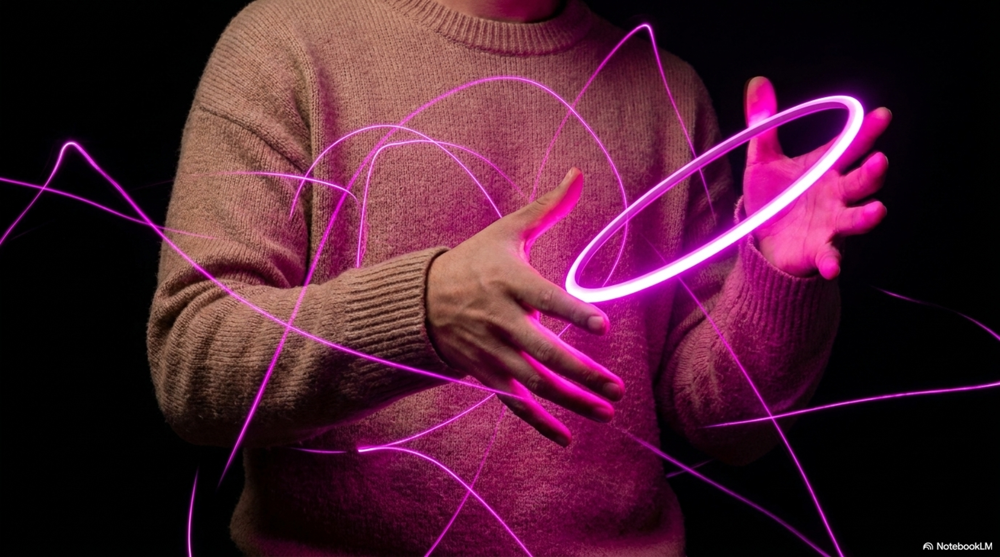

import StatGrid from '../../components/StatGrid.astro';
import Callout from '../../components/Callout.astro';
import Diagram from '../../components/Diagram.astro';
import PullQuote from '../../components/PullQuote.astro';
import Takeaways from '../../components/Takeaways.astro';
import AnalogyTable from '../../components/AnalogyTable.astro';

<StatGrid items={[
  { value: "0", label: "Degrees of rotational freedom that matter for balls", sub: "a ball can spin any way and it makes no difference to the catch - orientation is irrelevant", color: "tech" },
  { value: "1", label: "Axis of rotation that matters for clubs", sub: "the long axis - the club must arrive handle-first regardless of all other spin", color: "change" },
  { value: "∞", label: "Stable orientations a spinning ring maintains", sub: "the gyroscopic effect locks the ring in its launch plane - it arrives at the same angle it left", color: "brain" },
  { value: "~200g", label: "Typical juggling club weight", sub: "heavier than a ball, lighter than it looks - most of the weight is in the knob for rotation balance", color: "yellow" }
]} />

Look at the triptych. Left: two balls, each an identical glowing sphere. Center: a ring making a figure-eight. Right: clubs leaving spiral trails as they spin. Three props. Three entirely different physical systems.

The common description - "juggling involves throwing and catching objects" - is accurate but hides the depth of what changes between prop types. Balls exploit pure projectile mechanics. Clubs add a rotational degree of freedom that must be precisely controlled. Rings add gyroscopic stability that no other prop has. Learning all three is not learning variations on a theme. It is learning three separate disciplines that happen to share a rhythm.

## The ball: pure projectile

A juggling ball is the closest physical approximation to an ideal point mass. Its shape is symmetric, its mass is evenly distributed, and its orientation at catch is completely irrelevant. You can catch a ball from any direction, at any angle, with any face of the ball toward you.

This is what makes balls the starting point for juggling. The only variables that matter are position and timing. The juggler's neural problem is purely spatial and temporal: where is the ball, when will it arrive, and where should the hand be.

The physical constraint is entirely in the parabolic trajectory. Given a fixed tempo and beat value (see: The Mathematics of Siteswap), the peak height is determined. The juggler must throw consistently to the same height, and catch at the correct position. Nothing else is constrained.

**Moment of inertia of a solid sphere:** `I = (2/5) * m * r²`

For a 68mm, 130g juggling ball: approximately 0.000095 kg·m². Spinning at 5 rev/s would generate angular momentum of 0.003 kg·m²/s - small, and since any orientation is a valid catch orientation, it is irrelevant in practice.

<Diagram caption="The three prop types and their key physical parameters. Balls: position-only problem. Clubs: position plus rotation angle. Rings: position plus stable gyroscopic plane.">
<svg viewBox="0 0 560 200" xmlns="http://www.w3.org/2000/svg" fill="none">
  <rect width="560" height="200" rx="8" fill="#0d0d1a"/>

  <text x="93" y="22" fill="#33cc66" font-size="12" font-family="sans-serif" text-anchor="middle" font-weight="600">Ball</text>
  <text x="280" y="22" fill="#ff8c00" font-size="12" font-family="sans-serif" text-anchor="middle" font-weight="600">Club</text>
  <text x="467" y="22" fill="#cc44ff" font-size="12" font-family="sans-serif" text-anchor="middle" font-weight="600">Ring</text>

  <line x1="187" y1="15" x2="187" y2="195" stroke="#2a2a3d" stroke-width="1"/>
  <line x1="374" y1="15" x2="374" y2="195" stroke="#2a2a3d" stroke-width="1"/>

  <circle cx="93" cy="80" r="22" fill="#33cc66" opacity="0.15" stroke="#33cc66" stroke-width="1.5"/>
  <circle cx="93" cy="80" r="22" fill="none" stroke="#33cc66" stroke-width="1.5"/>
  <text x="93" y="84" fill="#33cc66" font-size="9" font-family="monospace" text-anchor="middle">sphere</text>

  <rect x="268" y="50" width="24" height="60" rx="12" fill="#ff8c00" opacity="0.15" stroke="#ff8c00" stroke-width="1.5"/>
  <circle cx="280" cy="45" r="10" fill="#ff8c00" opacity="0.3" stroke="#ff8c00" stroke-width="1.5"/>
  <line x1="280" y1="45" x2="280" y2="110" stroke="#ff8c00" stroke-width="2" opacity="0.6"/>
  <path d="M270 55 Q280 50 290 55" stroke="#ff8c00" stroke-width="1" opacity="0.5"/>
  <path d="M270 75 Q280 70 290 75" stroke="#ff8c00" stroke-width="1" opacity="0.5"/>

  <circle cx="467" cy="90" r="35" fill="none" stroke="#cc44ff" stroke-width="3" opacity="0.7"/>
  <ellipse cx="467" cy="90" rx="35" ry="8" fill="none" stroke="#cc44ff" stroke-width="1" opacity="0.3"/>

  <text x="93" y="125" fill="#9696b0" font-size="9" font-family="monospace" text-anchor="middle">orientation:</text>
  <text x="93" y="137" fill="#33cc66" font-size="9" font-family="monospace" text-anchor="middle">irrelevant</text>
  <text x="93" y="155" fill="#9696b0" font-size="9" font-family="monospace" text-anchor="middle">catch window:</text>
  <text x="93" y="167" fill="#33cc66" font-size="9" font-family="monospace" text-anchor="middle">360° any axis</text>
  <text x="93" y="185" fill="#9696b0" font-size="9" font-family="monospace" text-anchor="middle">key constraint: height</text>

  <text x="280" y="125" fill="#9696b0" font-size="9" font-family="monospace" text-anchor="middle">orientation:</text>
  <text x="280" y="137" fill="#ff8c00" font-size="9" font-family="monospace" text-anchor="middle">critical (1 axis)</text>
  <text x="280" y="155" fill="#9696b0" font-size="9" font-family="monospace" text-anchor="middle">catch window:</text>
  <text x="280" y="167" fill="#ff8c00" font-size="9" font-family="monospace" text-anchor="middle">handle-down only</text>
  <text x="280" y="185" fill="#9696b0" font-size="9" font-family="monospace" text-anchor="middle">key constraint: spin rate</text>

  <text x="467" y="125" fill="#9696b0" font-size="9" font-family="monospace" text-anchor="middle">orientation:</text>
  <text x="467" y="137" fill="#cc44ff" font-size="9" font-family="monospace" text-anchor="middle">locked by gyroscope</text>
  <text x="467" y="155" fill="#9696b0" font-size="9" font-family="monospace" text-anchor="middle">catch window:</text>
  <text x="467" y="167" fill="#cc44ff" font-size="9" font-family="monospace" text-anchor="middle">planar - one plane</text>
  <text x="467" y="185" fill="#9696b0" font-size="9" font-family="monospace" text-anchor="middle">key constraint: release plane</text>
</svg>
</Diagram>

## The club: rotation as a second problem

The image above - an orange club surrounded by spiral light - shows what balls never show: the rotational trajectory. That spiral is the club's body tracing a helix through space as it spins on its long axis while following a parabolic path through the air.

A club has two simultaneous motions: translational (the center of mass following a parabola, identical to a ball) and rotational (spinning around the long axis). The juggler must control both independently.

The rotational problem: the club must arrive at the catching hand with the handle pointing toward the catcher. This means the number of rotations during flight must be an integer (or near-integer). For a single spin, the club rotates once. For a double spin, twice.

**The constraint equation:**

`n_rotations = t_flight * omega / (2*pi)`

Where `t_flight` is determined by throw height and tempo (see: The Physics of the Throw), and `omega` is the angular velocity at release. The juggler must calibrate `omega` at release to produce an integer result given the fixed `t_flight`.

In practice this means: for a given throw height, there is exactly one angular velocity that produces a single spin, and exactly twice that for a double spin. The wrist snap at release sets `omega`. Expert club jugglers develop the proprioceptive sensitivity to hit this value consistently within approximately 5% tolerance - tight enough to produce a catchable handle orientation.

**Body rotation asymmetry:** The human wrist can apply more torque clockwise than counterclockwise for most people. This means dominant-hand club throws often have slightly higher spin rates than non-dominant throws, requiring calibrated compensation in the non-dominant wrist.

## The ring: gyroscopic immunity

The ring in this image is doing something that looks casual but is physically remarkable: it is maintaining its orientation. As it moves through space, the plane of the ring stays fixed. This is the gyroscopic effect, and rings have it in a way that neither balls nor clubs can match.

A ring spinning at angular velocity `omega` around its central axis has angular momentum:

`L = I * omega = m * r² * omega`

For a 32cm diameter, 200g ring spinning at 4 rev/s: `L ≈ 0.200 * (0.16)² * 25 = 0.128 kg·m²/s`

By conservation of angular momentum, this vector stays fixed in space unless an external torque acts on it. Gravity acts through the center of mass, which coincides with the geometric center, producing zero torque on the spin axis. The ring therefore maintains its launch plane throughout the flight.

This has a critical consequence for technique: **the release determines everything**. If you release a ring with a wobble - a small deviation from pure planar spin - the gyroscopic effect will preserve that wobble for the entire flight. The ring arrives wobbling. There is no self-correction in flight, unlike balls which can be caught from any angle.

The expert ring juggler's technique focuses entirely on achieving a clean, planar release: the ring leaves the fingertips with pure spin, no wobble, in exactly the plane the hand presents.

<AnalogyTable
  headers={["Property", "Ball", "Club", "Ring"]}
  rows={[
    ["Orientation at catch", "Irrelevant - any face acceptable", "Critical - handle must point toward catcher", "Preserved - arrives in same plane as released"],
    ["Key release parameter", "Height and direction", "Height + angular velocity (spin rate)", "Height + release plane (must be wobble-free)"],
    ["In-flight correction", "Any wobble or spin is fine", "None - integer spin is required", "None - release errors are permanent"],
    ["Error recovery", "Very forgiving - re-throw from any orientation", "Moderate - wrong spin phase = dropped catch", "Difficult - wobble propagates to next throw"],
    ["Learning progression", "First prop - few constraints", "Second - adds rotational calibration", "Often third - least forgiving release"]
  ]}
/>

## What the nervous system learns differently

The three props recruit different neural systems not just because they feel different, but because they impose different constraints.

**Balls** primarily develop the visuospatial prediction system - the internal model of parabolic trajectories. The cerebellum tracks position and timing; the visual cortex contributes trajectory prediction.

**Clubs** additionally develop proprioceptive calibration of wrist torque. The basal ganglia, which encodes motor sequences, must learn a specific release torque value for each throw height. EEG studies suggest club juggling recruits more somatosensory cortex activity than ball juggling at equivalent skill levels.

**Rings** additionally demand proprioceptive awareness of hand plane orientation. The release plane is set by the orientation of the hand at the moment of release - a parameter that is not visible to the juggler and must be felt. Research on proprioceptive acuity (Ribot-Ciscar and colleagues) suggests that repeated ring practice improves wrist-plane sensitivity measurable with joint position tests.

<PullQuote>
"The triptych image is not three variations on one skill. It is three separate physical problems that happen to share a timing structure. Each prop requires the nervous system to solve a fundamentally different constraint at release."
</PullQuote>

## Further reading

- **Hess, D.T.** (1992). "The biomechanics of the juggling throw." *International Journal of Sport Biomechanics*, 8(4), 382-399. Club rotation analysis.
- **Cross, R.** (2011). "The physics of juggling a spinning ping-pong ball." *European Journal of Physics*, 32(4). Gyroscopic and spin effects.
- **Schmidt, R.A., and Lee, T.D.** (2011). *Motor Control and Learning: A Behavioral Emphasis*. Human Kinetics. Chapter on degrees of freedom in motor learning, directly applicable to club vs ring vs ball technique.
- **Ribot-Ciscar, E. et al.** (2009). "Proprioceptive population coding of limb position in humans." *Journal of Neurophysiology*, 101(3). Baseline for proprioceptive acuity measurement.

<Takeaways items={[
  "A ball has no relevant orientation - any face can be caught. A club must arrive handle-down. A ring arrives in exactly the plane it was released. Three props, three completely different orientation constraints.",
  "Club spin rate must satisfy n_rotations = t_flight * omega / 2pi. This means there is exactly one angular velocity for a single spin at a given throw height - the juggler calibrates this via proprioception at release.",
  "A spinning ring is a gyroscope: angular momentum conservation locks its launch plane throughout flight. Release wobble is permanent - there is no in-flight correction. The entire technique focus shifts to release quality.",
  "The three props recruit different neural subsystems: balls develop visuospatial prediction; clubs add wrist-torque proprioception; rings add hand-plane orientation sensitivity. Each trains something the others do not."
]} />

---

*On this site: [The Physics of the Throw](/post/the-physics-of-the-throw) provides the mechanical foundation - parabolic trajectories, angular momentum, Shannon's theorem - that underlies all three prop types. [The Four-Ball Fountain](/post/the-four-ball-fountain) examines how moving from balls to an even ball count changes the coupling structure of the pattern. [The Juggler's Sphere](/post/the-jugglers-sphere) explores what happens when all three prop types are active simultaneously.*
