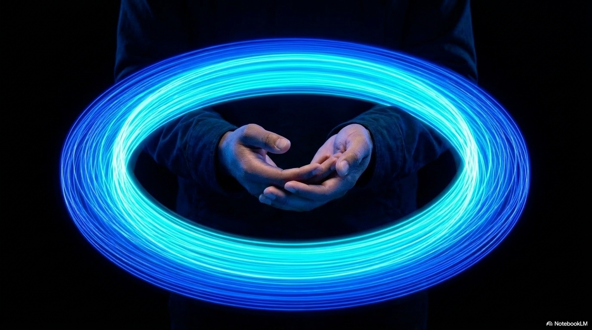

import StatGrid from '../../components/StatGrid.astro';
import Callout from '../../components/Callout.astro';
import Diagram from '../../components/Diagram.astro';
import PullQuote from '../../components/PullQuote.astro';
import Takeaways from '../../components/Takeaways.astro';
import AnalogyTable from '../../components/AnalogyTable.astro';

<StatGrid items={[
  { value: "~10,000", label: "Motor neurons in one hand", sub: "the hand has the highest density of motor neurons in the human body, giving it the finest grain of motor control of any body part", color: "brain" },
  { value: "17,000+", label: "Touch receptors per hand", sub: "mechanoreceptors, thermoreceptors, and proprioceptors in the skin and joints - the hand is the body's highest-bandwidth sensory surface", color: "tech" },
  { value: "30min", label: "Time for initial motor encoding", sub: "research shows that motor memories begin consolidating within 30 minutes of practice - sleep accelerates the process significantly", color: "change" },
  { value: "decades", label: "Retention of consolidated motor skills", sub: "well-consolidated motor skills - including the juggling cascade - remain retrievable for 30+ years with minimal decay, unlike declarative memory", color: "yellow" }
]} />

Motor learning begins in contact. Before any throw, before any catch, before any pattern, there is the sensory signal of what the object weighs, how it sits, how far it extends from the palm. The hand is not just an end-effector for a brain that has already decided what to do. It is a sensor sending information that shapes what the brain learns - and it does so on a faster timescale than vision can match. Johansson and Flanagan (Nature Reviews Neuroscience, 2009) showed that tactile signals from the fingertips drive predictive grip-force control in the first few milliseconds of contact, well before the visual system has registered what is happening.

## Proprioception: the sense you cannot turn off

Proprioception is the sense of body position and movement, mediated by mechanoreceptors in the muscles, tendons, and joint capsules. Unlike vision, which can be closed, or hearing, which can be blocked, proprioception cannot be suppressed. The body always knows where its parts are.

For juggling, proprioception provides three categories of information that vision alone cannot:

**1. Release timing.** The hand knows when it opens. Vision of a released ball is always slightly delayed relative to the actual release event - the ball has already left when the eye registers the departure. Proprioception provides the ground truth of when contact ended.

**2. Throw force.** The amount of muscle force applied to a throw is felt proprioceptively before any visual feedback is available. Expert jugglers can detect small force deviations at release and begin corrective action on the next throw before the errant ball has even reached its apex.

**3. Catch quality.** Whether a catch was clean, partial, or near-miss is registered hapticly in the first 20 milliseconds of contact - long before the visual system has processed the ball's position relative to the hand.

<Diagram caption="The timeline of sensory information during a single juggling throw and catch. Proprioception (P) and haptics (H) precede visual confirmation (V) at both throw and catch. Motor adjustment (M) begins before visual data arrives.">
<svg viewBox="0 0 560 160" xmlns="http://www.w3.org/2000/svg" fill="none">
  <rect width="560" height="160" rx="8" fill="#0d0d1a"/>

  <line x1="40" y1="80" x2="530" y2="80" stroke="#2a2a3d" stroke-width="1"/>

  <text x="40" y="100" fill="#9696b0" font-size="8" font-family="monospace" text-anchor="middle">0ms</text>
  <text x="160" y="100" fill="#9696b0" font-size="8" font-family="monospace" text-anchor="middle">200ms</text>
  <text x="280" y="100" fill="#9696b0" font-size="8" font-family="monospace" text-anchor="middle">400ms</text>
  <text x="400" y="100" fill="#9696b0" font-size="8" font-family="monospace" text-anchor="middle">600ms</text>
  <text x="520" y="100" fill="#9696b0" font-size="8" font-family="monospace" text-anchor="middle">800ms</text>

  <rect x="40" y="40" width="8" height="30" rx="2" fill="#ff3366" opacity="0.9"/>
  <text x="44" y="35" fill="#ff3366" font-size="8" font-family="monospace" text-anchor="middle">P</text>
  <text x="44" y="25" fill="#9696b0" font-size="7" font-family="monospace" text-anchor="middle">release</text>

  <rect x="55" y="40" width="8" height="30" rx="2" fill="#33cc66" opacity="0.9"/>
  <text x="59" y="35" fill="#33cc66" font-size="8" font-family="monospace" text-anchor="middle">V</text>

  <rect x="70" y="52" width="8" height="18" rx="2" fill="#3b6cff" opacity="0.8"/>
  <text x="74" y="48" fill="#3b6cff" font-size="8" font-family="monospace" text-anchor="middle">M</text>

  <text x="85" y="65" fill="#9696b0" font-size="7" font-family="monospace">throw</text>

  <rect x="350" y="40" width="8" height="30" rx="2" fill="#ff3366" opacity="0.9"/>
  <text x="354" y="35" fill="#ff3366" font-size="8" font-family="monospace" text-anchor="middle">H</text>
  <text x="354" y="25" fill="#9696b0" font-size="7" font-family="monospace" text-anchor="middle">catch</text>

  <rect x="370" y="40" width="8" height="30" rx="2" fill="#33cc66" opacity="0.9"/>
  <text x="374" y="35" fill="#33cc66" font-size="8" font-family="monospace" text-anchor="middle">V</text>

  <rect x="390" y="52" width="8" height="18" rx="2" fill="#3b6cff" opacity="0.8"/>
  <text x="394" y="48" fill="#3b6cff" font-size="8" font-family="monospace" text-anchor="middle">M</text>

  <text x="405" y="65" fill="#9696b0" font-size="7" font-family="monospace">catch</text>

  <text x="40" y="140" fill="#9696b0" font-size="8" font-family="monospace">P = proprioception/haptics (0-10ms lag)   V = visual (80-100ms lag)   M = motor adjustment</text>
  <text x="40" y="153" fill="#9696b0" font-size="8" font-family="monospace">Motor adjustment begins before visual confirmation at both throw and catch.</text>
</svg>
</Diagram>

## How motor memory differs from declarative memory

The hands remember the cascade even when the brain has forgotten everything else about the day. This is not a metaphor - it is an accurate description of how motor memory is organized in the nervous system.

Declarative memory (facts, events, explicit knowledge) is primarily stored in the hippocampus and associated cortical regions. It is fragile, vulnerable to interference, and subject to reconsolidation errors.

**Motor (procedural) memory** is stored in a distributed system that includes:
- The primary motor cortex (M1) - the specific muscle commands
- The cerebellum - the timing and error-correction parameters
- The basal ganglia - the sequencing and initiation of motor programs
- The spinal cord - reflexive components of the learned movement
- The muscles themselves - myelin density changes from repeated activation

This distribution is the source of motor memory's extraordinary durability. A single component of the system can be damaged without losing the skill entirely. A stroke affecting M1 impairs execution but leaves the cerebellar timing intact. Cerebellar damage disrupts timing but leaves the gross motor sequence in the basal ganglia.

<Callout type="info" title="The declarative/procedural memory distinction">
Squire, L.R. (1992). "Declarative and nondeclarative memory: Multiple brain systems supporting learning and memory." *Journal of Cognitive Neuroscience*, 4(3), 232-243. The foundational paper establishing the biological basis of the declarative/procedural memory distinction. Motor skill learning is the paradigm case of procedural memory.
</Callout>

## Ring gyroscopes and the hand's spatial memory

A spinning ring resists changes to its orientation - this is the gyroscopic effect, and proprioception has to solve it. To keep the ring stable, the hands must continuously adjust to hold a plane without destabilizing the spin. The ring provides force feedback: if the hands pull it off-plane, they feel the gyroscopic resistance.

This is haptic learning in real time. The hands are not following instructions from the brain about how to hold a gyroscope. The ring's physical behavior is teaching the hands directly through force feedback what the correct hold feels like.

Research on haptic learning (Johansson and Flanagan, 2009) shows that the brain builds a forward model of object dynamics from tactile contact signals. After sufficient exposure to an object - say, a spinning ring - the forward model predicts the ring's force responses before contact, allowing proactive grip adjustments rather than reactive corrections.

Expert ring jugglers describe the sensation of "feeling" a badly-set ring before they can see it wobble - the forward model detects the off-plane gyroscopic force at the moment of catch and predicts the wobble that will develop during the subsequent throw.

## Sleep and motor consolidation

Motor memories are not fixed at the end of practice. They consolidate over time, with sleep playing a critical role.

Walker, Brakefield, Morgan, Hobson, and Stickgold (2002) showed that motor sequence learning improves by approximately 20% during sleep, without additional practice. The consolidation happens during slow-wave sleep and REM sleep through a process of synaptic strengthening and pruning that optimizes the motor program.

This has direct practical implications: short practice sessions followed by sleep are more effective for motor learning than extended sessions without sleep. A 30-minute juggling practice followed by a night of sleep produces more durable encoding than 90 minutes of practice without sleep between sessions.

For juggling specifically: the period of instability where a pattern is almost-but-not-quite stable benefits most from sleep consolidation. The overnight process completes the stabilization that conscious practice left partially done.

<AnalogyTable
  headers={["Memory type", "Storage location", "Durability", "What it encodes"]}
  rows={[
    ["Declarative (facts)", "Hippocampus + neocortex", "Moderate - vulnerable to interference", "What happened, what you know"],
    ["Motor procedural", "M1 + cerebellum + basal ganglia + spinal cord", "Very high - decades of retention", "How to move, timing parameters, force calibration"],
    ["Haptic/tactile", "Somatosensory cortex + cerebellar forward model", "High - object-specific", "What an object feels like to manipulate"],
    ["Proprioceptive calibration", "Cerebellum + spinal circuits", "Stable once set", "Body position sense, joint angles, muscle state"]
  ]}
/>

## The ten-thousand hour question

Malcolm Gladwell's "ten thousand hours" popularized the idea that expert performance requires this fixed amount of practice. The neuroscience of motor learning suggests the real picture is more nuanced:

- The quality of practice matters more than quantity (deliberate practice vs repetition)
- Sleep between sessions multiplies the effect of practice
- The type of variability matters: random practice schedules produce more durable motor memory than blocked practice of the same skill
- Once consolidated, motor skills remain highly stable even without practice for years

For juggling: a juggler who practiced for 1000 hours 20 years ago and has not juggled since can typically recover the 3-ball cascade within 15-30 minutes. The motor memory does not disappear - it is simply slower to retrieve until the neural pathways are warmed up.

<PullQuote>
"The hands cup the ball and already know its weight. This is not a metaphor. The forward model built from hundreds of previous contacts predicts the weight before the full grip is established. The hands remember because the nervous system encoded the object's physics as part of learning to manipulate it."
</PullQuote>

## Further reading

- **Squire, L.R.** (1992). "Declarative and nondeclarative memory." *Journal of Cognitive Neuroscience*, 4(3), 232-243.
- **Walker, M.P. et al.** (2002). "Practice with sleep makes perfect: sleep-dependent motor skill learning." *Neuron*, 35(1), 205-211. The foundational sleep-consolidation paper.
- **Johansson, R.S., and Flanagan, J.R.** (2009). "Coding and use of tactile signals from the fingertips in object manipulation tasks." *Nature Reviews Neuroscience*, 10(5), 345-359.
- **Schmidt, R.A.** (1975). "A schema theory of discrete motor skill learning." *Psychological Review*, 82(4), 225-260. The schema theory of motor learning, which explains how general motor programs generalize to novel variations.
- **Ericsson, K.A., Krampe, R.T., and Tesch-Römer, C.** (1993). "The role of deliberate practice in the acquisition of expert performance." *Psychological Review*, 100(3), 363-406. The original deliberate practice paper.

<Takeaways items={[
  "Proprioception and haptics precede visual information by 60-90ms at both throw and catch. Motor adjustment begins before visual confirmation arrives - expert juggling runs on proprioceptive, not visual, feedback.",
  "Motor memory is stored in a distributed system: M1 (commands), cerebellum (timing), basal ganglia (sequencing), spinal cord (reflexes). This distribution explains why motor skills survive decades and neurological damage that would destroy declarative memory.",
  "Spinning rings teach the hands directly through haptic feedback: the gyroscopic resistance felt at contact builds a forward model that eventually predicts off-plane orientation before it can be seen.",
  "Sleep consolidation adds approximately 20% motor performance gain overnight without additional practice. Short sessions followed by sleep outperform extended sessions without sleep for motor skill acquisition.",
  "The '10,000 hour' rule is not about raw time - quality of practice, sleep between sessions, and variability of training conditions matter more than total hours. Consolidated motor skills survive 20+ years without practice."
]} />

---

*On this site: [Juggling and the Science of Attention](/post/juggling-and-the-science-of-attention) covers the complementary finding - that expert performance runs on prediction rather than reaction, made possible by the motor memory described here. [What Actually Happens in Your Brain When You Juggle](/post/what-happens-in-your-brain) covers the structural brain changes - grey matter density and white matter connectivity - that are the physical substrate of motor learning. [The Juggler's Sphere](/post/the-jugglers-sphere) explores the limits of automatization when multiple prop types are added simultaneously.*
